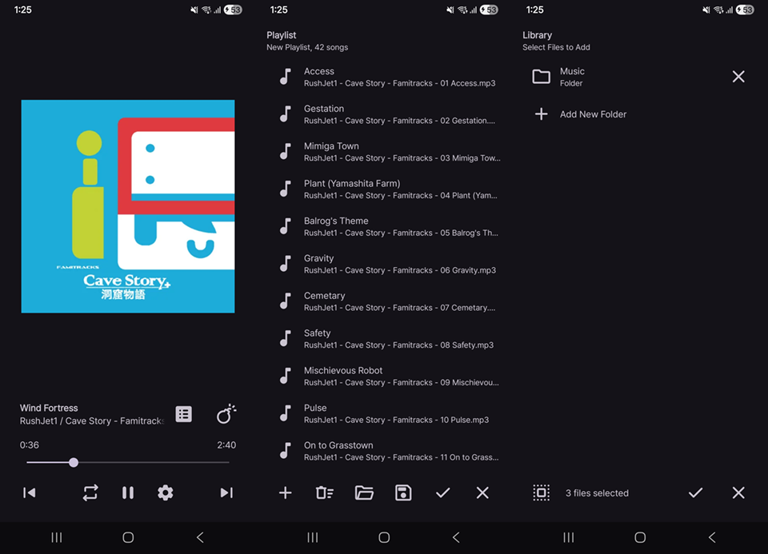

# Uranus

Uranus is an *opinionated* music player for Android.

As with many of my projects, Uranus is made mainly for my personal use.

# Work in Progress

Uranus is currently in an early stage of development: barely works, lots of problems, fine by me.

No support will be provided until the project reaches some stable point.

# Screenshots

Note: Screenshot from an early build; things are subject to change.

# To-dos

- [x] File-based Playlist system
- [ ] YT-style double-tap to seek
- [ ] Volume multiplier
- [ ] Sleep timer

# License

Uranus is distributed under the GNU GPL v3.
