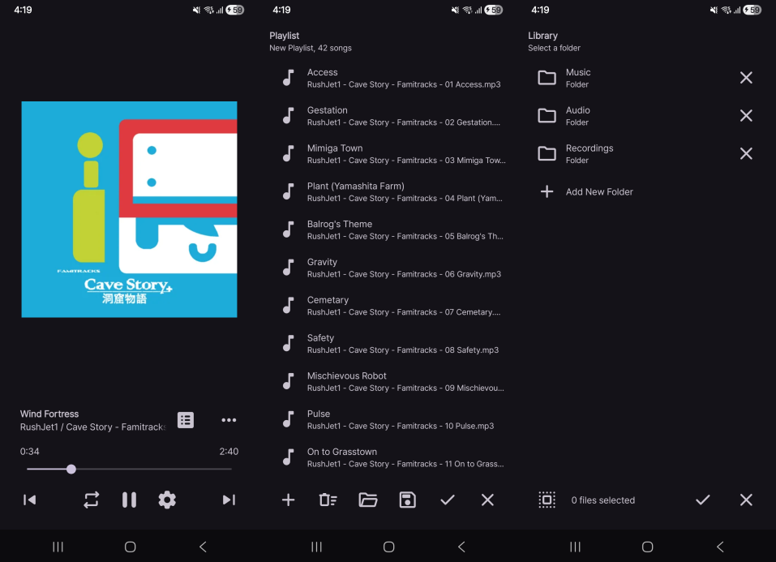

# Uranus

Uranus is a file-based music player for Android.

As with many of my projects, Uranus is made mainly for my personal use.

# Download

Grab the APK from [here](https://github.com/sinusinu/Uranus/releases/latest).

# Screenshots

# License

Uranus is distributed under the GNU GPL v3.
