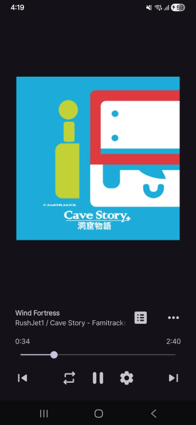
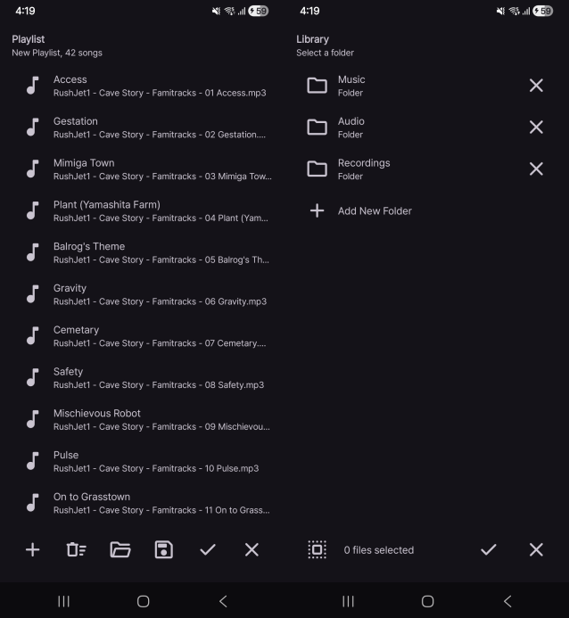
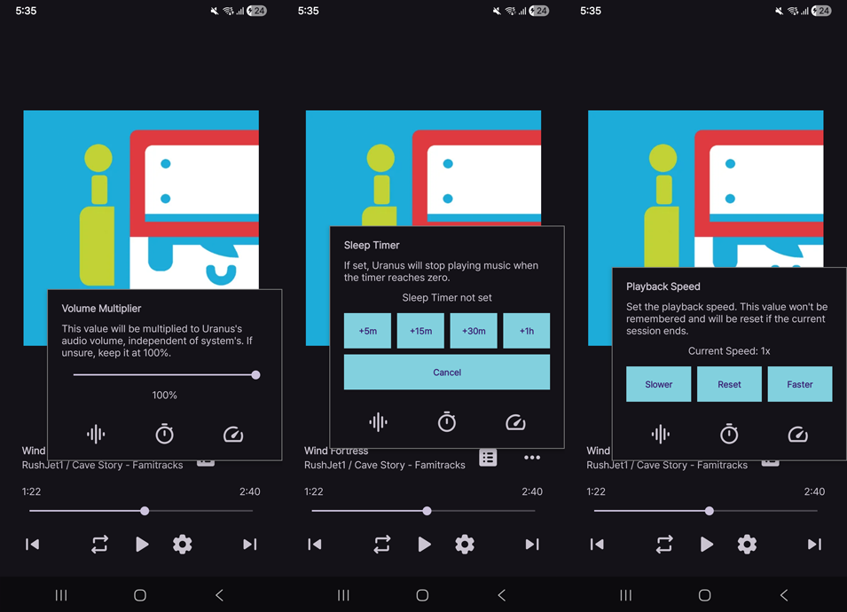

# Uranus

Uranus is an *opinionated* music player for Android.

As with many of my projects, Uranus is made mainly for my personal use.

# Work in Progress

Uranus is currently in an early stage of development.

No support will be provided until the project reaches some stable point.

# Download

Grab the APK from [here](https://github.com/sinusinu/Uranus/releases/latest).

Remember, no support. I don't accept any bug reports or pull requests for now.

# What's *opinionated* about it?

I like this kind of design.

The flagship idea of Uranus is the *File-based Playlist System*, where you build your own *playlists* by picking up *files*, instead of just browsing Android's pre-scanned system media library.

This idea aims to provide a more PC-like experience rather than the mobile one, which I personally prefer.

And of course, it contains niche features (I like) too!

Note: Screenshots from an alpha build; things are subject to change.

# License

Uranus is distributed under the GNU GPL v3.
