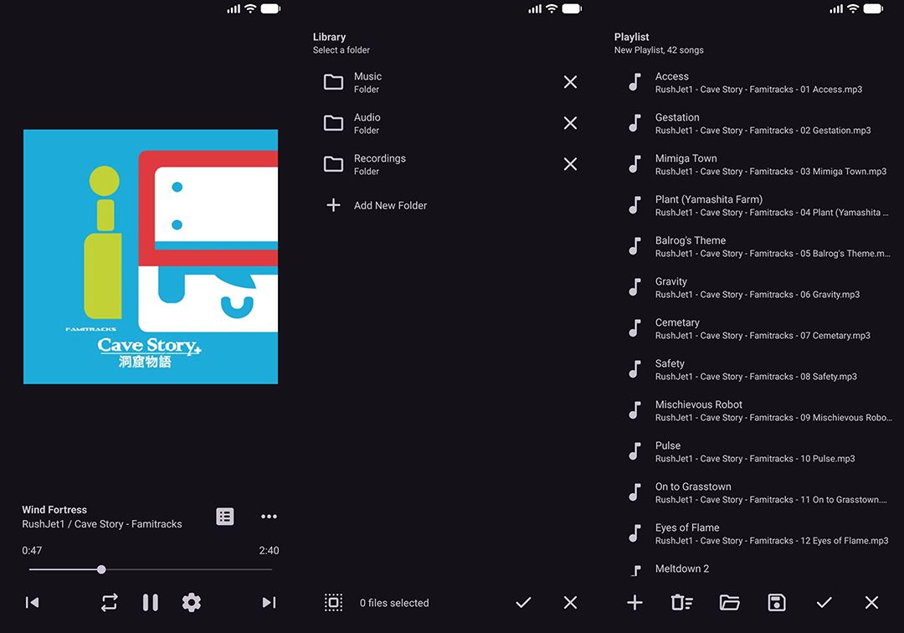

# Uranus

A file-picking music player

# Features

- SAF-based, File-picking playlist system
- A bunch of weird features, including:
  - Volume multiplier
  - Sleep timer
  - Playback speed modifier

# Download

or grab the APK directly from [here](https://github.com/sinusinu/Uranus/releases/latest).

# Screenshots

# License

Uranus is distributed under the GNU GPL v3.
